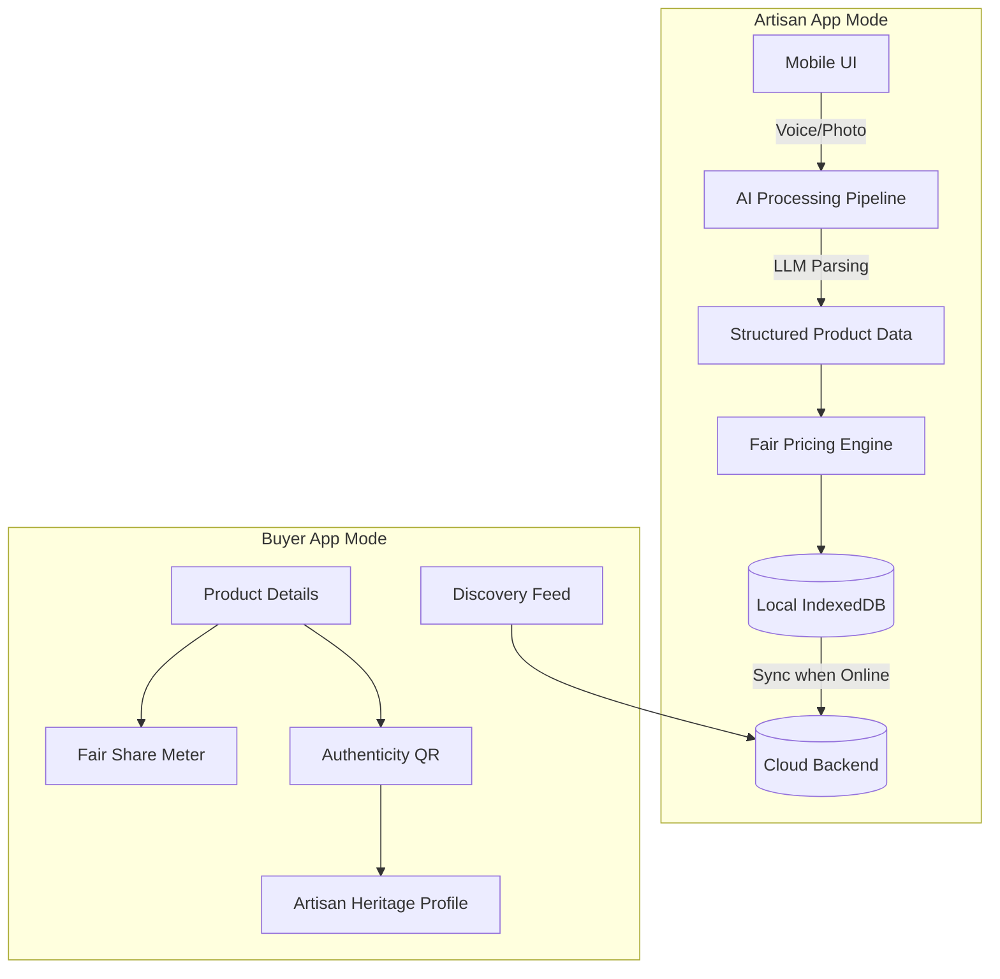

# KalaSetu: AI-Driven Market Linkage for Marginalized Artisans

A Smart India Hackathon Prototype.

## The Problem
Marginalized artisans lack the digital literacy to catalog their products on standard e-commerce platforms, and often lose out on fair pricing due to middlemen. 

## Our Solution
KalaSetu (Bridge of Art) is a mobile-first Progressive Web App that uses **Voice AI and Vision AI** to automate product cataloging. Artisans simply speak into their phones or take a photo, and the AI generates structured listings and suggests a fair price based on material and labor costs.

### Key Features
1. **Voice-to-Catalog & Photo-to-Listing**: AI extracts details and structures them.
2. **Fair Pricing Engine**: Suggests prices to ensure a living wage based on hours worked.
3. **Heritage Authenticity Certificate (QR)**: Buyers can scan a QR code to see the artisan's story.
4. **Transparency Meter**: Buyers see exactly what percentage of their payment goes to the artisan.
5. **Offline-First Sync**: Artisans can catalog products in low-connectivity areas; the app syncs when online.

---

## Architecture



---

## Packaging: PWA & Android APK

KalaSetu is designed to be installed as a real mobile app via two methods:

### 1. Progressive Web App (PWA)
The app is fully configured as a PWA with a `manifest.json` and service worker. 
When hosted and accessed via Chrome or Safari on a mobile device, users will be prompted to **"Add to Home Screen"**. It will install with the KalaSetu app icon and launch in standalone mode (no browser UI).

### 2. Native Android APK (Capacitor)
For judges who want to see a native app installation, the project is wrapped in Capacitor.
To generate or update the APK before a pitch:

```bash
# 1. Build the production web assets
npm run build

# 2. Sync the built assets to the Android project
npx cap sync android

# 3. Open Android Studio to build the APK
npx cap open android
# (In Android Studio, go to Build -> Build Bundle(s) / APK(s) -> Build APK(s))
```

---

## 90-Second Demo Script

**Setup:** Run the app locally and open it in a mobile-sized browser window.

**1. Buyer Discovery (0:00 - 0:15)**
* "Welcome to KalaSetu. We're currently in Buyer Mode looking at the Discovery feed."
* *Click on 'Decorative Blue Vase'.*
* "Unlike standard e-commerce, our product pages feature a 'Fair Share Transparency Meter'. Here you can see exactly how much of your money goes directly to the artisan."
* *Scroll down.*
* "Every product comes with a QR Authenticity Certificate to prevent fakes."

**2. Artisan Heritage (0:15 - 0:30)**
* *Click the Artisan profile banner or the QR Code area.*
* "Scanning the QR code takes buyers to the Artisan's Story page. This connects buyers with the rich cultural heritage of the creator, building trust and value."

**3. Artisan Mode: The Core Innovation (0:30 - 0:50)**
* *Click the floating 'Switch to Artisan Mode' button.*
* "But the real magic is how these products get cataloged. We are now in Artisan Mode. Our artisans often have low digital literacy. So we made cataloging as easy as sending a voice note."
* *Click 'Add Item' in the bottom nav. Click 'Use Voice (AI)'.*
* "The artisan just describes what they made in their native language."
* *Wait for the mock AI to process.*
* "Our AI pipeline transcribes the audio, translates it, and structures it into a title, description, and tags."

**4. Fair Pricing Engine (0:50 - 1:10)**
* *Click 'Continue to Pricing'.*
* "Next is the Fair Pricing Engine. Instead of guessing, the artisan enters material cost and hours worked. The app suggests a fair price that guarantees a living wage."
* *Click 'Publish to Catalog'.*

**5. Offline-First (1:10 - 1:30)**
* "We also built this to be offline-first. If an artisan is in a village with no signal, they can still catalog items."
* *In DevTools, set Network to Offline. Add another item quickly using the 'Take Photo' shortcut.*
* "Notice the 'Waiting for Internet' tag in the catalog. It queues locally."
* *Set Network to Online.*
* "Once they get a signal, it automatically syncs. This is KalaSetu: bridging the digital divide for India's artisans."

---

## Run Instructions
```bash
npm install
npm run dev
```
